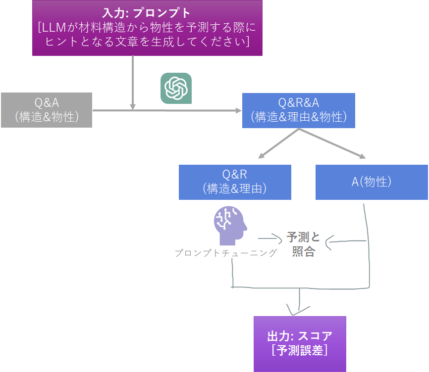
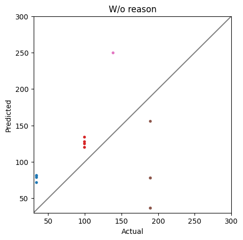
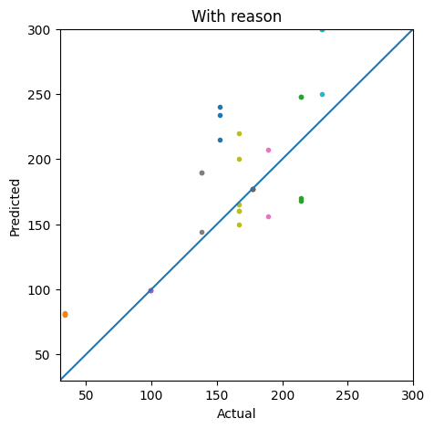

# 分子の構造(Q)ー融点(A)データセットから説明(Reason: R)を自動生成して､説明付きで予測するデモ

# 情報
- 2023/12/16
- kan hatakeyama

# アイデア
- [こちらの記事を参照](https://note.com/kan_hatakeyama/n/n56afe0df282a)
- 

# 使い方
- api_key.pyを作成し､openaiのapiキーを設定(api_key ="***" )
- [QTA_gen_practice.ipynb](QRA_gen_practice.ipynb)を実行
- [Analyze_gen.ipynb](Analyze_gen.ipynb)で解析

# 結果
- 条件
  - ランダムに選択した10分子で比較
  - GPT3.5で理由生成&回答
  - ランダム性を考慮して､予測は独立に3回
  - 単一の予測において､範囲が10-20のように示された場合､10,20にplot
- 結果
  - オリジナルのモデル
    - "回答不能"な結果が帰ってきたデータが過半数を占めたので､そもそもプロットが少ない
    - 精度も微妙
    - 

  - Rを生成して回答させたモデル
    - 予測精度が向上
    - 

# 考察
  - 上記の結果は､ある種の訓練データになってしまっている点に注意
    - 自動生成された理由の大半が､「未知分子の融点は､GPT3.5が知っている既知分子の融点の+XX℃である」という感じになっている
      - この思考法自体は悪くないが､本質的にモデルの予測性能が向上したとは言い難い
  - 最終目的は､このような自動生成されたデータセットを使ってモデルをファインチューニングし､未知分子について､Qのみから､RとAを生成すること

# TODO
  - プロンプトチューニング
  - 更に多くの分子での検討
  - ファインチューニング
# Issue
  - 自動生成されたテキストから融点の数値を抜き出す関数にバグ有り([code](src/utils/clean_prediction.py))