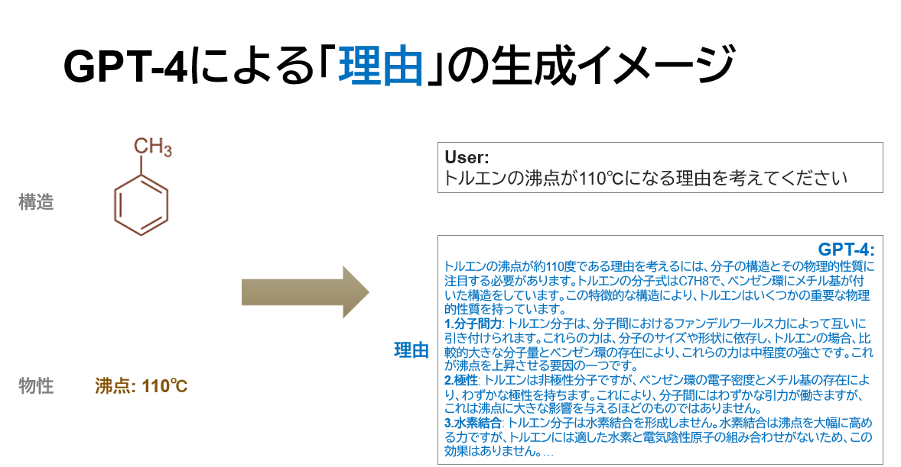
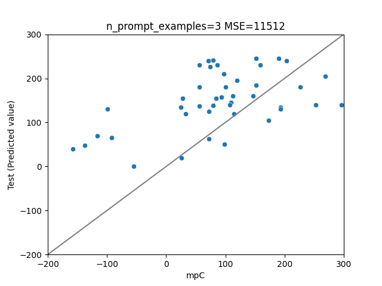
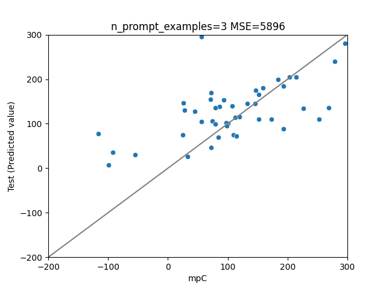

# 分子の構造(Q)ー融点(A)データセットから説明(Reason: R)を自動生成して､説明付きで予測

# 情報
- オープンに進めています

# Setup
- git clone https://github.com/KanHatakeyama/LLMChem

# 関連Note(上から順にnew)
- [24/1/15大規模言語モデルが自分で作った文章を「自習」をさせながら､分子物性の予測精度を上げる試行 ](https://note.com/kan_hatakeyama/n/n5683cad82587)
- [24/1/5概要スライドほか](https://www.docswell.com/s/KanHatakeyama/KGXYQL-2024-01-05-135948?utm_source=twitter&utm_medium=social&utm_campaign=singlepage)
- [Llama2を「化学物性+言語」データセットでファインチューニングして融点を予測させる](https://note.com/kan_hatakeyama/n/n74c8b2b3b4e7?sub_rt=share_pb )
- [言語データセットを用い､プロンプトチューニングで分子構造から融点を予測する際のメモ](https://note.com/kan_hatakeyama/n/n43ddd541bdc6)
- [なぜ分子の融点が◯◯℃なのかをGPT-4に考えさせる際の試行錯誤メモ ](https://note.com/kan_hatakeyama/n/n84c84da8f551)
- [Explainableな構造ー物性の予測LLMモデルを作る研究の「目標とTODO」メモ](https://note.com/kan_hatakeyama/n/n56afe0df282a)
- [Explainableな構造ー物性データセットをLLMで自動生成する(定量的な説明ver) ](https://note.com/kan_hatakeyama/n/ndcdeaed60f48)
- [explainableな構造ー物性相関のLLM予測モデルのデータセットの自動生成 ](https://note.com/kan_hatakeyama/n/n8e5506240630)

- 
- 

# 結果の例
- [GoogleColabのNotebook(24/1/4)](https://drive.google.com/file/d/1Hn61xplqK2zDxMQ_yp1qPt2kpBwO8a8T/view?usp=sharing)
- [codeはこちら](https://github.com/KanHatakeyama/LLMChem/tree/20231216pub)
- 条件
  - GPT-4で理由を自動生成(約2500件 計算済み)
  - LLama2で構造ー理由ー物性データをLoRAファインチューニング
  - ランダムに選択した50分子の融点を予測
- 結果
  - オリジナルのLLama2-13b
    - 

  - 構造ー理由ー物性の関係を学習したモデル 
    - 予測精度が向上
    - 

# 研究進捗
- 2023/12/16
  - フレームを作成
- 12/24
  - 再帰などを実装
  - 融点データセットの計算を開始 (約300件/2.5万件)
- 12/29
  - プロンプトチューニングやファインチューニングを軽く実装
- 2024/1/4
  - ファインチューニングを本格実装
  - 推論の高速化 など
  - Google Colabのサンプルコードを実装